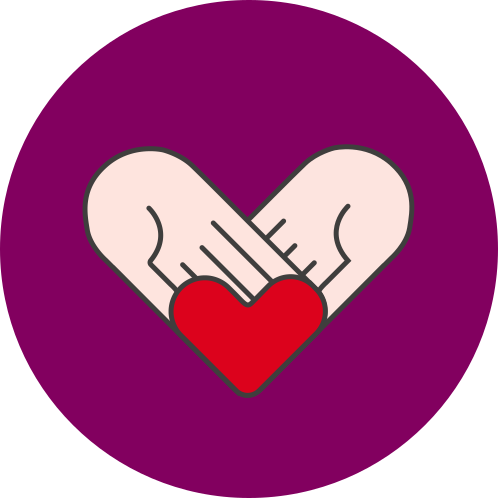
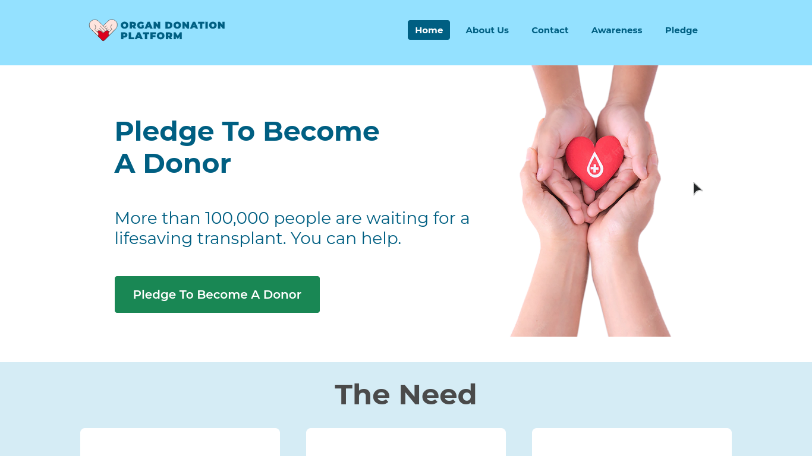
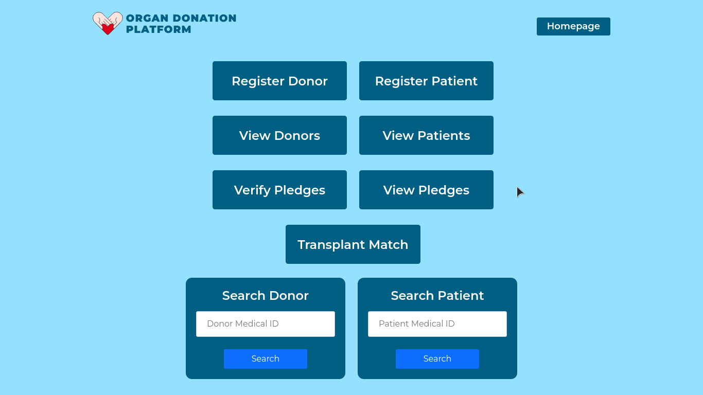
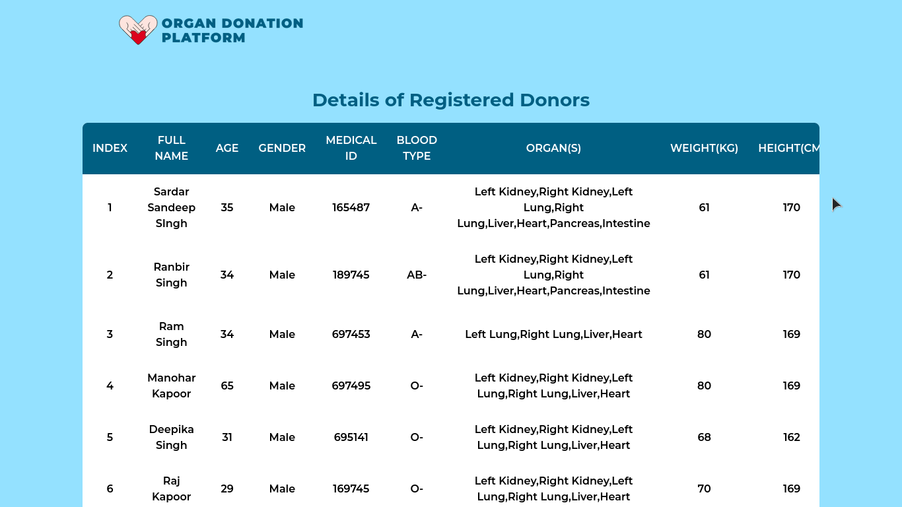
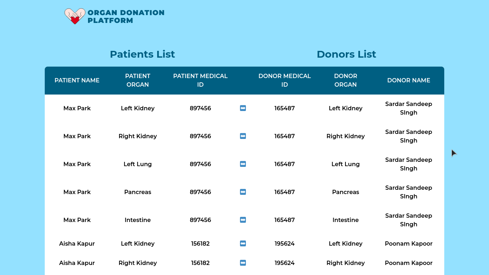

<a name="readme-top"></a>

[![Contributors][contributors-shield]][contributors-url]
[![Forks][forks-shield]][forks-url]
[![Stargazers][stars-shield]][stars-url]
[![Issues][issues-shield]][issues-url]
<!-- [![MIT License][license-shield]][license-url] -->

<!-- PROJECT LOGO -->
<br />
<div align="center">
  <a href="https://github.com/rahulsabinkar/organ-donation-platform">
    
  </a>

<h3 align="center">Organ Donation Platform</h3>

  <p align="center">
    A dApp platform connecting organ donor and acceptor via ethereum blockchain.
    <br />
    <!-- <a href="https://github.com/rahulsabinkar/organ-donation-platform"><strong>Explore the docs »</strong></a>
    <br />
    <br /> -->
    <!-- <a href="https://github.com/rahulsabinkar/organ-donation-platform">View Demo</a> -->
  </p>
</div>

## Screenshots

### Landing Page



### Dashboard



### Viewing Database



### Transplant Matching



<p align="right">(<a href="#readme-top">back to top</a>)</p>

## Built With

* [![Solidity][solidity-shield-url]][solidity-url]
* [![Node][node-shield-url]][node-url]

<p align="right">(<a href="#readme-top">back to top</a>)</p>

## Prerequisites

You would need these software installed on your machine to run the project.
### node.js

  #### Windows:
  1. Visit the NodeJS web page at https://nodejs.org/en/
  2. Download and install the LTS version.
  3. Download the installer and run it. This will install both NodeJS and NPM (Node
  Package Manager).
  
  Note: If you're on Windows 11, make sure to have latest LTS version of nodejs installed, or else you'll probably run into some issues.

  #### Arch Linux:
  Open a terminal and type the following command.
  ```sh
  sudo pacman -S nodejs npm
  ```

  #### Ubuntu:
  Open a terminal and type these commands in order.
  ```sh
    sudo apt update
    sudo apt install nodejs
    sudo apt install npm
  ```
  #### RedHat, Fedora, CentOS:
  ```sh
  sudo yum update
  curl -sL https://rpm.nodesource.com/setup_14.x | sudo bash -
  ```
  #### MacOS:
  1. Download the LTS application binary for MacOS.
  2. When the file finishes downloading, locate it in Finder and double-click on it.
  3. Go through the entire installation process.
   
### Truffle
Open the command prompt or terminal and execute the following command.
```sh
npm install -g truffle
```

### Ganache
Visit the Ganache webpage at http://trufflesuite.com/ganache/
Download the platform binary for your OS and install it.

### Git

#### Arch Linux
```sh
sudo pacman -S git
```

#### Ubuntu
```sh
sudo apt update
sudo apt install git
```

#### Windows
Install gitbash from https://gitforwindows.org/

## Installation

### Download
1. Open gitbash or terminal.
2. Clone the repo.
   ```sh
   git clone https://github.com/rahulsabinkar/organ-donation-platform.git
   ```
3. Traverse into the app folder.
   ```sh
   cd organ-donation-platform/app
   ```
4. Install npm dependencies.
   ```sh
   npm install
   ```

### Connect Ganache
While the npm dependencies are being installed, follow these instructions.
1. Open ganache.
2. Click on "New Workspace".
3. Select "Add Project" and add the truffle-config.js file located in the folder "organ-donation-platform" you just downloaded.
4. Confirm by pressing "Save Workspace" on the top-right corner.
5. Navigate to the "Contracts" tab and you should notice DonorContract is not deployed.

### Deploy Contract
Back in the gitbash or terminal window instance in which you were downloading npm dependencies, wait for it to finish up and then type in the following commands to deploy the contract.
```sh
truffle compile && truffle migrate
```

### Run the server
Now that everything is set-up, you can run the server.
1. Run the following command
   ```sh
   npm run dev
   ```
2. Open a browser and go to http://localhost:8080/

<p align="right">(<a href="#readme-top">back to top</a>)</p>

## Team Members

* [Rahul Sabinkar](https://github.com/RahulSabinkar)
* [Sai Manikanta Teja](https://github.com/SaiManikantaTeja)

<p align="right">(<a href="#readme-top">back to top</a>)</p>


<!-- MARKDOWN LINKS & IMAGES -->
<!-- https://www.markdownguide.org/basic-syntax/#reference-style-links -->
[contributors-shield]: https://img.shields.io/github/contributors/rahulsabinkar/organ-donation-platform.svg?style=for-the-badge
[contributors-url]: https://github.com/rahulsabinkar/organ-donation-platform/graphs/contributors
[forks-shield]: https://img.shields.io/github/forks/rahulsabinkar/organ-donation-platform.svg?style=for-the-badge
[forks-url]: https://github.com/rahulsabinkar/organ-donation-platform/network/members
[stars-shield]: https://img.shields.io/github/stars/rahulsabinkar/organ-donation-platform.svg?style=for-the-badge
[stars-url]: https://github.com/rahulsabinkar/organ-donation-platform/stargazers
[issues-shield]: https://img.shields.io/github/issues/rahulsabinkar/organ-donation-platform.svg?style=for-the-badge
[issues-url]: https://github.com/rahulsabinkar/organ-donation-platform/issues
[node-shield-url]: https://img.shields.io/badge/node.js-brightgreen?style=for-the-badge&logo=nextdotjs&logoColor=white
[node-url]: https://nodejs.org/
[solidity-shield-url]: https://img.shields.io/badge/solidity-blue?style=for-the-badge&logo=solidity&logoColor=white
[solidity-url]: https://soliditylang.org/